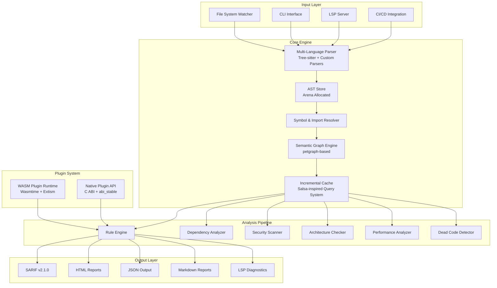
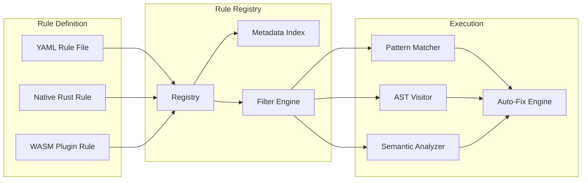
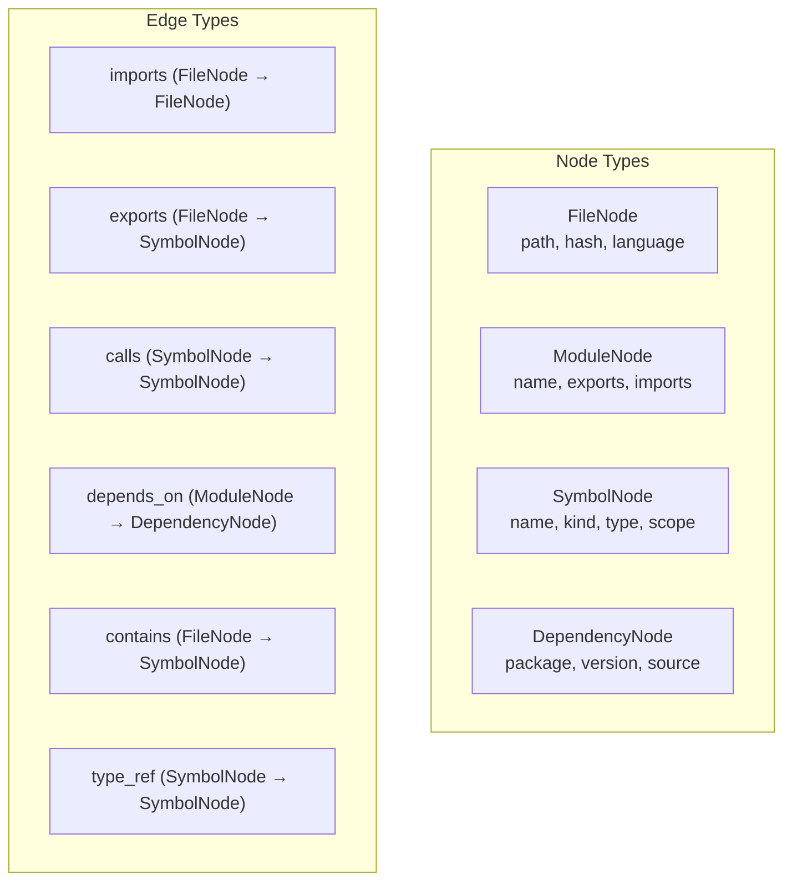
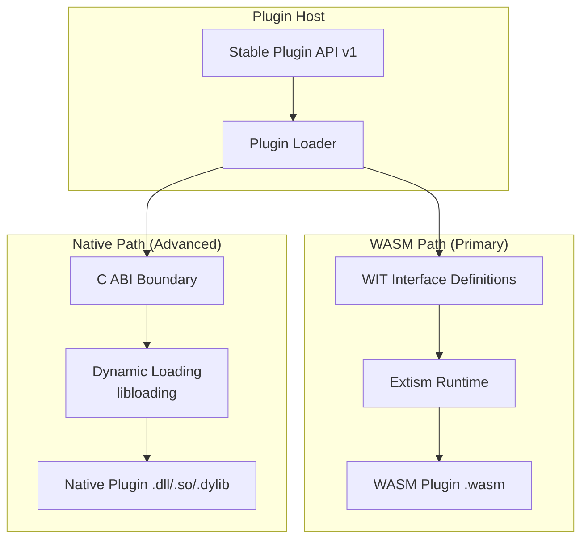
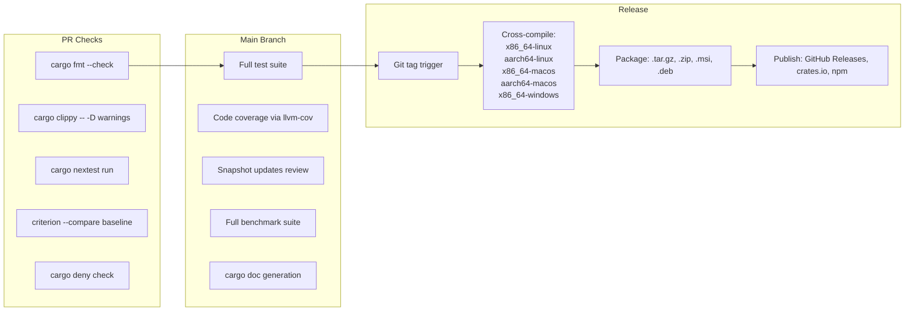

# SNOWBROS Inspector — Architecture Research & Design

> **Role**: Chief Software Architect & Principal Compiler Engineer
> **Status**: Research Complete — Awaiting Approval Before Implementation

---

## 1. Complete System Architecture

SNOWBROS Inspector is a **high-performance, multi-language static analysis platform** built in Rust. The architecture draws from the best ideas in Biome, Oxc, rust-analyzer, Ruff, Semgrep, and CodeQL while creating a unique unified analysis engine.

### High-Level Architecture Diagram



### Core Design Principles (Learned from Industry)

| Principle | Inspiration | Rationale |
|:---|:---|:---|
| **One-Parse Architecture** | Biome/Rome | Parse code once, reuse AST for all analyses. Eliminates redundant work. |
| **Query-Based Incrementalism** | rust-analyzer/Salsa | Demand-driven, memoized computations. Only recompute what changed. |
| **Arena-Allocated AST** | Oxc | Minimize allocator pressure; all AST nodes in contiguous memory. |
| **Parallel-First** | Ruff, Rayon | Process files in parallel by default. No GIL, no bottlenecks. |
| **Modular Crate Design** | Oxc | Each subsystem is an independent crate usable standalone. |
| **Pattern + Semantic Hybrid** | Semgrep + CodeQL | Fast pattern matching for 80% of rules; deep semantic analysis for the rest. |

---

## 2. Recommended Technology Stack

### Language & Runtime

| Component | Choice | Justification |
|:---|:---|:---|
| **Primary Language** | Rust (stable) | Memory safety, zero-cost abstractions, fearless concurrency, no GC pauses |
| **Plugin Runtime** | Wasmtime + Extism | Sandboxed, cross-language plugins with near-native performance |
| **Build System** | Cargo (workspace) | Native Rust build with workspace for multi-crate project |
| **Secondary Target** | WASM (wasm32-wasi) | For browser-based playground and editor extensions |

### Core Crate Stack

| Subsystem | Crate | Version/Status | Why |
|:---|:---|:---|:---|
| **AST Parsing (multi-lang)** | `tree-sitter` | Stable, 40+ grammars | Incremental, error-tolerant, multi-language with unified API |
| **JS/TS Fast Parsing** | `oxc_parser` | Active | Fastest JS/TS parser, arena-allocated AST |
| **Graph Engine** | `petgraph` | Stable | Battle-tested directed graph with Tarjan SCC, toposort, BFS/DFS |
| **Parallelism** | `rayon` | Stable | Drop-in parallel iterators, work-stealing thread pool |
| **Serialization** | `serde` + `serde_json` | Essential | Industry standard, zero-copy deserialization support |
| **CLI Framework** | `clap` (derive) | v4.x stable | Derive-based API, shell completions, subcommands |
| **Logging/Tracing** | `tracing` + `tracing-subscriber` | Stable | Structured, context-aware, async-compatible observability |
| **File Walking** | `ignore` | Stable (by BurntSushi) | Respects `.gitignore`, parallel directory traversal |
| **File Watching** | `notify` | Stable | Cross-platform fs events (inotify/FSEvents/ReadDirectoryChangesW) |
| **Caching** | Custom (Salsa-inspired) | Custom | Demand-driven memoized queries with dependency tracking |
| **LSP Server** | `tower-lsp` | Stable | Async, Tower-based, battle-tested in production servers |
| **LSP Types** | `lsp-types` | Stable | Complete LSP specification types |
| **Text Handling** | `ropey` | Stable | Rope data structure for efficient text editing in LSP |
| **SARIF Output** | `serde-sarif` | Active | Serde-compatible SARIF v2.1.0 generation |
| **HTML Reports** | `tera` + `minijinja` | Stable | Jinja2-compatible templating for HTML reports |
| **Markdown Gen** | `pulldown-cmark` | Stable | Spec-compliant CommonMark parser/renderer |
| **JSON Schema** | `schemars` | Stable | Derive-based JSON Schema generation from Rust types |
| **Config Files** | `toml` + `serde` | Stable | TOML for config (like `snowbros.toml`) |
| **Path Handling** | `camino` | Stable | UTF-8 paths (eliminates OsStr pain on Windows) |
| **Hashing** | `xxhash-rust` | Stable | Fastest non-crypto hash for file content fingerprinting |
| **Error Handling** | `miette` | Stable | Beautiful diagnostic error messages with source snippets |
| **Color Output** | `owo-colors` | Stable | Zero-allocation terminal colors |
| **Progress Bars** | `indicatif` | Stable | Progress bars and spinners for CLI feedback |
| **Regex** | `regex` | Stable | Thompson NFA-based, guaranteed O(n) |
| **Glob Patterns** | `globset` | Stable (by BurntSushi) | Efficient compiled glob matching |
| **Interning** | `string_cache` or `lasso` | Stable | String interning for symbol tables |
| **Arena Allocator** | `bumpalo` | Stable | Bump allocation for AST nodes (like Oxc) |
| **Date/Time** | `chrono` or `time` | Stable | Timestamp handling for reports |
| **HTTP Client** | `reqwest` | Stable | For fetching remote rule packs and vulnerability DBs |
| **Async Runtime** | `tokio` | Stable | For LSP server and async I/O operations |

### Testing & Quality

| Tool | Purpose |
|:---|:---|
| `cargo-nextest` | Fast parallel test runner with per-test isolation |
| `insta` | Snapshot testing for AST output, SARIF, and rule diagnostics |
| `criterion` | Rigorous statistical benchmarking with HTML reports |
| `divan` | Fast collocated micro-benchmarks during development |
| `cargo-flamegraph` / `samply` | CPU profiling and flame graph generation |
| `cargo-mutants` | Mutation testing to verify test effectiveness |
| `cargo-deny` | License and vulnerability auditing for dependencies |
| `cargo-udeps` | Detect unused dependencies |

---

## 3. Best GitHub Repositories to Learn From

### Tier 1 — Study Architecture Deeply

| Repository | What to Learn | License |
|:---|:---|:---|
| [biomejs/biome](https://github.com/biomejs/biome) | CST-based analysis, unified toolchain, LSP integration, rule organization | MIT |
| [oxc-project/oxc](https://github.com/oxc-project/oxc) | Arena-allocated AST, fastest JS/TS parser, modular crate design | MIT |
| [rust-lang/rust-analyzer](https://github.com/rust-lang/rust-analyzer) | Salsa query system, incremental computation, LSP server patterns | MIT/Apache-2.0 |
| [astral-sh/ruff](https://github.com/astral-sh/ruff) | Parallel file processing, caching strategy, rule re-implementation in Rust | MIT |
| [semgrep/semgrep](https://github.com/semgrep/semgrep) | YAML rule format, pattern-matching engine, multi-language support | LGPL-2.1 |
| [github/codeql](https://github.com/github/codeql) | Relational query engine, deep taint analysis, control flow graphs | MIT (queries) |

### Tier 2 — Extract Specific Ideas

| Repository | What to Extract |
|:---|:---|
| [nicolo-ribaudo/tc39-proposal-structs](https://github.com/nicolo-ribaudo/tc39-proposal-structs) (Babel) | Transform pipeline architecture |
| [nickel-org/rust-clippy](https://github.com/rust-lang/rust-clippy) | Lint categorization system, diagnostic messages, auto-fix patterns |
| [sverweij/dependency-cruiser](https://github.com/sverweij/dependency-cruiser) | Architecture validation rules, dependency rule DSL |
| [webfansplz/vite-plugin-vue-inspector](https://github.com/nickel-lang/nickel) | Plugin loading patterns |
| [tree-sitter/tree-sitter](https://github.com/tree-sitter/tree-sitter) | Incremental parser, grammar specification, multi-language bindings |
| [AcalaNetwork/AcalaNetwork](https://github.com/AcalaNetwork/AcalaNetwork) — [knip](https://github.com/webpro-nl/knip) | Dead code detection approach, unused export analysis |
| [nrwl/nx](https://github.com/nrwl/nx) | Project graph, affected analysis, workspace orchestration |
| [nicolo-ribaudo/nicolo-ribaudo](https://github.com/nicolo-ribaudo/nicolo-ribaudo) — [trivy](https://github.com/aquasecurity/trivy) | Vulnerability database sync, multi-target scanning |
| [nicolo-ribaudo/nicolo-ribaudo](https://github.com/nicolo-ribaudo/nicolo-ribaudo) — [osv-scanner](https://github.com/google/osv-scanner) | OSV schema, reachability analysis for reducing false positives |

### Tier 3 — Reference for Specific Patterns

| Repository | Pattern |
|:---|:---|
| [nickel-lang/nickel](https://github.com/nickel-lang/nickel) | Contract-based configuration language |
| [nicolo-ribaudo/salsa](https://github.com/salsa-rs/salsa) | Incremental computation framework directly |
| [nicolo-ribaudo/extism](https://github.com/nicolo-ribaudo/extism) — [extism/extism](https://github.com/extism/extism) | WASM plugin SDK |
| [nicolo-ribaudo/swc](https://github.com/nicolo-ribaudo/swc) — [swc-project/swc](https://github.com/swc-project/swc) | Transform visitor patterns, error recovery |

---

## 4. Best Rust Crates for Each Subsystem

### Complete Crate Matrix

| Subsystem | Primary Crate | Alternative | Notes |
|:---|:---|:---|:---|
| **Multi-lang Parsing** | `tree-sitter` | `rowan` (for custom langs) | Tree-sitter for 40+ langs; Rowan if building a custom parser |
| **JS/TS Parsing** | `oxc_parser` | `swc_ecma_parser` | Oxc is 3x faster; SWC is more mature |
| **Graph Processing** | `petgraph` | `daggy` (DAG-only) | Petgraph has Tarjan SCC, toposort, Dijkstra built-in |
| **Parallel Processing** | `rayon` | `crossbeam` (channels) | Rayon for data parallelism; crossbeam for fine-grained concurrency |
| **File Watching** | `notify` | `watchman_client` | Notify is cross-platform; Watchman for Facebook-scale repos |
| **Caching** | `salsa` | `dashmap` + custom | Salsa for query memoization; DashMap for concurrent key-value |
| **Serialization** | `serde` | — | Non-negotiable; the entire ecosystem depends on it |
| **CLI** | `clap` (derive) | `bpaf` | Clap is standard; bpaf is smaller |
| **Config** | `toml` + `figment` | `config-rs` | Figment supports layered config (file + env + CLI) |
| **Logging** | `tracing` | `log` (legacy compat) | Tracing is the modern standard |
| **FS Walking** | `ignore` | `walkdir` | `ignore` includes gitignore support; `walkdir` is lower-level |
| **Testing** | `insta` + nextest | `proptest` (property) | Snapshot + property-based testing combo |
| **Benchmarking** | `criterion` + `divan` | — | Criterion for CI; divan for local |
| **Profiling** | `pprof-rs` | `samply` (external) | pprof for programmatic; samply for interactive |
| **Plugin Loading (WASM)** | `wasmtime` + `extism` | `wasmer` | Wasmtime is Bytecode Alliance's reference engine |
| **Plugin Loading (Native)** | `libloading` | `abi_stable` | C ABI through `libloading`; `abi_stable` for Rust-to-Rust |
| **WASM Bindings** | `wit-bindgen` | `wasm-bindgen` | WIT for Component Model; wasm-bindgen for browser |
| **LSP** | `tower-lsp` | `lsp-server` | tower-lsp for ergonomics; lsp-server for max control |
| **Markdown** | `pulldown-cmark` | `comrak` (GFM) | pulldown-cmark for CommonMark; comrak for GitHub-flavored |
| **HTML Reports** | `minijinja` | `tera` | MiniJinja is smaller and faster; Tera is more feature-rich |
| **SARIF** | `serde-sarif` | `sarif_rust` | serde-sarif for serde integration; sarif_rust for validation |
| **JSON Schema** | `schemars` | — | Derive-based, pairs naturally with serde |
| **String Interning** | `lasso` | `string_cache` | lasso is concurrent-safe and faster |
| **Arena Allocation** | `bumpalo` | `typed-arena` | bumpalo for mixed-type arenas (like Oxc) |
| **Rope (Text)** | `ropey` | `crop` | ropey is the standard for LSP text buffers |
| **Error Display** | `miette` | `ariadne` | miette for CLI; ariadne for compiler-style errors |
| **Path Handling** | `camino` | `dunce` (Windows) | UTF-8 paths; dunce to strip `\\?\` prefixes on Windows |
| **HTTP** | `reqwest` | `ureq` (sync, smaller) | reqwest for async; ureq if you want minimal deps |
| **Async Runtime** | `tokio` | `smol` | tokio for ecosystem; smol for minimal |
| **Regex** | `regex` | `regex-automata` | Both by BurntSushi; regex-automata for advanced DFA control |
| **Glob** | `globset` | `glob` | globset compiles globs into efficient matchers |
| **Hashing** | `xxhash-rust` | `blake3` | xxhash for speed; blake3 if you need crypto-strength |
| **Compression** | `zstd` | `lz4_flex` | zstd for cache files |
| **Diff** | `similar` | `diffy` | similar for unified diffs in reports |

---

## 5. Features to Adopt from Each Project

### ✅ ADOPT

| Source | Feature | How to Apply |
|:---|:---|:---|
| **Biome** | CST-based error-tolerant parsing | Use Tree-sitter CST for IDE integration; AST for batch analysis |
| **Biome** | Unified `biome.json` config | Single `snowbros.toml` for all analysis features |
| **Biome** | Rule categorization (nursery → stable) | Graduated rule maturity system |
| **Oxc** | Arena-allocated AST with `bumpalo` | Minimize heap allocations during parsing |
| **Oxc** | Modular crate workspace | Each subsystem as independent crate |
| **rust-analyzer** | Salsa-inspired query system | Incremental memoized computation for all analyses |
| **rust-analyzer** | Early cutoff optimization | Skip downstream recomputation when results haven't changed |
| **Ruff** | Parallel file processing with `rayon` | File-level parallelism for all analyzers |
| **Ruff** | Content-hash-based caching | Skip unchanged files on re-analysis |
| **Ruff** | Native rule re-implementation | Implement rules in Rust, not as wrappers |
| **Semgrep** | YAML-based rule definitions | User-friendly custom rule authoring |
| **Semgrep** | Pattern-matching with metavariables | `$VAR` pattern syntax for code patterns |
| **CodeQL** | Taint analysis and data flow tracking | For security rules requiring inter-procedural analysis |
| **CodeQL** | SARIF output format | Standard output for CI/CD integration |
| **Clippy** | Auto-fix with `--fix` flag | Automated code fixes where deterministic |
| **Clippy** | Lint groups (style, correctness, perf) | Organize rules by category and confidence |
| **dependency-cruiser** | Architecture validation rules | DSL for enforcing module boundaries |
| **Knip** | Project-level dead code detection | Unused files, exports, and dependencies |
| **Nx** | Project graph and affected analysis | Only analyze what changed |
| **Trivy** | Multi-source vulnerability DB sync | Aggregate RustSec, OSV, GitHub Advisory |
| **Prettier** | Parser ↔ Printer plugin hooks | Clean separation of parse and output in plugins |
| **ESLint** | Flat config with explicit object refs | `snowbros.config.js` as alternative config format |
| **Tree-sitter** | Grammar-based multi-language support | One grammar definition per language |

### 🔄 ADAPT (Don't Copy Directly)

| Source | Idea | Adaptation |
|:---|:---|:---|
| **CodeQL** | Full relational database of code | Too heavy; use petgraph-based semantic graph instead |
| **Semgrep** | OCaml core engine | Rewrite patterns in Rust for consistency |
| **Biome** | CST for everything | Use CST only for formatting/LSP; AST for analysis |
| **Rome** | "Replace everything" vision | Focus on analysis first; expand incrementally |
| **Nx** | JavaScript-based project graph | Reimplement graph construction in Rust |

---

## 6. Features to AVOID

| Source | Anti-Pattern | Why Avoid |
|:---|:---|:---|
| **Rome** | "Replace all tools at once" scope | Led to project collapse. Ship incrementally. |
| **CodeQL** | Compilation-required database creation | Too slow for CI feedback loops. Prefer instant analysis. |
| **ESLint (legacy)** | String-based plugin resolution | Brittle, hard to debug. Use explicit imports. |
| **Babel** | Plugin ordering dependencies | Rules must be order-independent. |
| **npm audit** | Noisy low-severity alerts | Provide confidence scoring to reduce alert fatigue. |
| **Rome** | Corporate-backed open source single point of failure | Design for community governance from day one. |
| **Prettier** | No way to disable specific formatting rules | Always allow granular configuration. |
| **ts-prune** | Single-purpose abandoned tools | Build comprehensive analysis, not single-feature tools. |

---

## 7. Project Folder Structure

```
snowbros-inspector/
├── Cargo.toml                    # Workspace root
├── snowbros.toml                 # Dog-food: our own config
├── LICENSE-MIT
├── LICENSE-APACHE
├── README.md
├── ARCHITECTURE.md               # This document
├── CONTRIBUTING.md
│
├── crates/
│   ├── snowbros_core/            # Core types, traits, error types
│   │   ├── src/
│   │   │   ├── lib.rs
│   │   │   ├── diagnostic.rs     # Diagnostic types (miette-compatible)
│   │   │   ├── severity.rs       # Error/Warning/Info/Hint
│   │   │   ├── config.rs         # Configuration types
│   │   │   ├── span.rs           # Source location types
│   │   │   └── project.rs        # Project/workspace model
│   │   └── Cargo.toml
│   │
│   ├── snowbros_parser/          # Multi-language parsing layer
│   │   ├── src/
│   │   │   ├── lib.rs
│   │   │   ├── language.rs       # Language detection & registry
│   │   │   ├── ast.rs            # Unified AST types
│   │   │   ├── treesitter.rs     # Tree-sitter integration
│   │   │   └── arena.rs          # Arena allocator for AST nodes
│   │   └── Cargo.toml
│   │
│   ├── snowbros_resolver/        # Symbol & import resolution
│   │   ├── src/
│   │   │   ├── lib.rs
│   │   │   ├── module.rs         # Module resolution (Node, Python, etc.)
│   │   │   ├── symbols.rs        # Symbol table & interning
│   │   │   └── imports.rs        # Import/export tracking
│   │   └── Cargo.toml
│   │
│   ├── snowbros_graph/           # Semantic graph engine
│   │   ├── src/
│   │   │   ├── lib.rs
│   │   │   ├── dependency.rs     # Dependency graph
│   │   │   ├── call_graph.rs     # Function call graph
│   │   │   ├── import_graph.rs   # Import/export graph
│   │   │   ├── type_graph.rs     # Type relationship graph
│   │   │   ├── algorithms.rs     # SCC, toposort, reachability
│   │   │   └── visualization.rs  # DOT/SVG export
│   │   └── Cargo.toml
│   │
│   ├── snowbros_cache/           # Incremental computation cache
│   │   ├── src/
│   │   │   ├── lib.rs
│   │   │   ├── query.rs          # Query system (Salsa-inspired)
│   │   │   ├── fingerprint.rs    # Content hashing (xxhash)
│   │   │   ├── store.rs          # Persistent cache store
│   │   │   └── invalidation.rs   # Dependency-based invalidation
│   │   └── Cargo.toml
│   │
│   ├── snowbros_rules/           # Rule engine
│   │   ├── src/
│   │   │   ├── lib.rs
│   │   │   ├── engine.rs         # Rule execution engine
│   │   │   ├── registry.rs       # Rule registration & discovery
│   │   │   ├── metadata.rs       # Rule metadata types
│   │   │   ├── pattern.rs        # Pattern matching (Semgrep-style)
│   │   │   └── autofix.rs        # Auto-fix infrastructure
│   │   ├── Cargo.toml
│   │   └── tests/
│   │       └── snapshots/        # insta snapshot tests
│   │
│   ├── snowbros_security/        # Security analysis
│   │   ├── src/
│   │   │   ├── lib.rs
│   │   │   ├── taint.rs          # Taint analysis engine
│   │   │   ├── vulnerability.rs  # Vulnerability DB integration
│   │   │   ├── supply_chain.rs   # Dependency vulnerability scanning
│   │   │   └── secrets.rs        # Secret detection
│   │   └── Cargo.toml
│   │
│   ├── snowbros_deps/            # Dependency analysis
│   │   ├── src/
│   │   │   ├── lib.rs
│   │   │   ├── lockfile.rs       # Lockfile parsers (package-lock, Cargo.lock, etc.)
│   │   │   ├── circular.rs       # Circular dependency detection
│   │   │   ├── unused.rs         # Unused dependency detection
│   │   │   └── impact.rs         # Dependency impact analysis
│   │   └── Cargo.toml
│   │
│   ├── snowbros_architecture/    # Architecture analysis
│   │   ├── src/
│   │   │   ├── lib.rs
│   │   │   ├── boundaries.rs     # Module boundary enforcement
│   │   │   ├── layers.rs         # Layer violation detection
│   │   │   ├── coupling.rs       # Coupling/cohesion metrics
│   │   │   └── dead_code.rs      # Dead code & unused exports
│   │   └── Cargo.toml
│   │
│   ├── snowbros_performance/     # Performance analysis
│   │   ├── src/
│   │   │   ├── lib.rs
│   │   │   ├── bundle.rs         # Bundle size analysis
│   │   │   ├── complexity.rs     # Cyclomatic complexity
│   │   │   ├── patterns.rs       # Anti-pattern detection
│   │   │   └── scoring.rs        # Project health scoring
│   │   └── Cargo.toml
│   │
│   ├── snowbros_plugin/          # Plugin system
│   │   ├── src/
│   │   │   ├── lib.rs
│   │   │   ├── wasm_host.rs      # WASM plugin host (Extism/Wasmtime)
│   │   │   ├── native_host.rs    # Native plugin host (libloading)
│   │   │   ├── api.rs            # Stable plugin API
│   │   │   └── manifest.rs       # Plugin manifest parsing
│   │   └── Cargo.toml
│   │
│   ├── snowbros_lsp/             # Language Server Protocol
│   │   ├── src/
│   │   │   ├── lib.rs
│   │   │   ├── server.rs         # LSP server (tower-lsp)
│   │   │   ├── handlers.rs       # Request/notification handlers
│   │   │   └── diagnostics.rs    # Diagnostic publishing
│   │   └── Cargo.toml
│   │
│   ├── snowbros_output/          # Output formatters
│   │   ├── src/
│   │   │   ├── lib.rs
│   │   │   ├── sarif.rs          # SARIF v2.1.0 output
│   │   │   ├── json.rs           # JSON output
│   │   │   ├── markdown.rs       # Markdown reports
│   │   │   ├── html.rs           # Interactive HTML reports
│   │   │   └── terminal.rs       # Colored terminal output
│   │   ├── Cargo.toml
│   │   └── templates/            # HTML report templates
│   │       ├── report.html
│   │       └── dashboard.html
│   │
│   └── snowbros_cli/             # CLI binary
│       ├── src/
│       │   ├── main.rs
│       │   ├── commands/
│       │   │   ├── mod.rs
│       │   │   ├── analyze.rs    # `snowbros analyze`
│       │   │   ├── check.rs      # `snowbros check`
│       │   │   ├── graph.rs      # `snowbros graph`
│       │   │   ├── fix.rs        # `snowbros fix`
│       │   │   ├── init.rs       # `snowbros init`
│       │   │   ├── rules.rs      # `snowbros rules list`
│       │   │   └── plugin.rs     # `snowbros plugin install`
│       │   └── progress.rs       # Progress reporting
│       └── Cargo.toml
│
├── rules/                        # Built-in rule definitions
│   ├── javascript/
│   │   ├── no-eval.yaml
│   │   ├── no-prototype-pollution.yaml
│   │   └── ...
│   ├── typescript/
│   ├── react/
│   ├── security/
│   ├── architecture/
│   └── performance/
│
├── grammars/                     # Tree-sitter grammars (git submodules)
│   ├── tree-sitter-javascript/
│   ├── tree-sitter-typescript/
│   ├── tree-sitter-python/
│   └── ...
│
├── plugins/                      # Example plugins
│   ├── example-wasm-plugin/
│   └── example-native-plugin/
│
├── tests/
│   ├── fixtures/                 # Test codebases
│   │   ├── small-project/
│   │   ├── monorepo/
│   │   └── million-lines/
│   ├── integration/
│   └── e2e/
│
├── benches/                      # Benchmarks
│   ├── parsing.rs
│   ├── graph_construction.rs
│   ├── rule_execution.rs
│   └── full_analysis.rs
│
├── docs/
│   ├── user-guide/
│   ├── rule-authoring/
│   ├── plugin-development/
│   └── architecture/
│
└── .github/
    └── workflows/
        ├── ci.yml
        ├── release.yml
        └── benchmark.yml
```

---

## 8. Rule Engine Architecture

### Design (Inspired by: Semgrep patterns + Clippy categorization + ESLint metadata)



### Rule Metadata Schema

```yaml
# rules/security/no-eval.yaml
id: "SEC001"
name: "no-eval"
version: "1.0.0"

metadata:
  category: "security"
  subcategory: "code-injection"
  severity: "error"           # error | warning | info | hint
  confidence: "high"          # high | medium | low
  maturity: "stable"          # nursery | preview | stable | deprecated
  
  # Framework/Language Filters
  languages: ["javascript", "typescript"]
  frameworks: ["react", "next", "express", "node"]
  
  # Documentation
  description: "Prevents use of eval() which enables code injection"
  rationale: "eval() executes arbitrary code and is a primary vector for XSS and RCE"
  recommendation: "Use JSON.parse() for data, Function constructor for dynamic code"
  
  # References
  references:
    - url: "https://owasp.org/Top10/A03_2021-Injection/"
      label: "OWASP A03:2021 - Injection"
    - cwe: 95
    - cve: []
  
  # Dependencies (other rules this relates to)
  related_rules: ["SEC002", "SEC003"]
  supersedes: []
  
  # Tags for filtering
  tags: ["owasp", "injection", "xss", "cwe-95"]

# Pattern Definition (Semgrep-style)
patterns:
  - pattern: "eval($EXPR)"
  - pattern: "window.eval($EXPR)"
  - pattern: "globalThis.eval($EXPR)"
  - pattern: "new Function($ARGS)"

# Auto-fix (optional)
fix:
  available: false
  description: null

# Test Cases (built-in regression tests)
tests:
  positive:          # Should trigger the rule
    - code: "eval('alert(1)')"
    - code: "window.eval(userInput)"
  negative:          # Should NOT trigger the rule  
    - code: "JSON.parse(data)"
    - code: "const evaluate = (x) => x * 2"

# Future: AI explanation template
ai_explanation:
  template: "This code uses {pattern} which allows arbitrary code execution..."
```

### Rule Engine Execution Model

1. **Registration**: Rules are loaded from YAML files, native Rust implementations, and WASM plugins into a central registry
2. **Filtering**: Before execution, rules are filtered by language, framework, severity, and user configuration
3. **Execution**: Three tiers of analysis:
   - **Tier 1 (Pattern)**: Semgrep-style pattern matching on AST. Fast, covers ~60% of rules
   - **Tier 2 (Visitor)**: AST visitor traversal with scope/type information. Medium speed, ~30% of rules
   - **Tier 3 (Semantic)**: Full semantic analysis (taint tracking, data flow). Slower, ~10% of rules
4. **Deduplication**: Results are deduplicated by location and rule
5. **Confidence Scoring**: Each result gets a confidence score based on analysis depth
6. **Auto-Fix**: Where applicable, fixes are computed and presented as suggestions

### Key Design Decisions

| Decision | Rationale |
|:---|:---|
| YAML for rule definitions | Low barrier to entry (like Semgrep), easy to version control |
| Native Rust for performance-critical rules | Zero overhead for hot-path rules |
| WASM for community rules | Safe sandbox, cross-language authoring |
| Rule maturity graduation | nursery → preview → stable prevents breaking changes |
| Independent testability | Each rule file includes test cases, runnable via `snowbros test-rules` |

---

## 9. Semantic Graph Architecture

The semantic graph is the **central data structure** that enables cross-file analysis, dead code detection, circular dependency detection, and architecture validation.

### Graph Model (petgraph-based)



### Graph Layers

| Layer | Purpose | Node Types | Update Strategy |
|:---|:---|:---|:---|
| **File Graph** | Import/export relationships | Files, Modules | Incremental (on file change) |
| **Symbol Graph** | Symbol definitions and references | Functions, Classes, Variables | Incremental (on file change) |
| **Call Graph** | Function call relationships | Functions, Methods | Recompute per-file, merge |
| **Type Graph** | Type inheritance and usage | Types, Interfaces | Lazy construction |
| **Dependency Graph** | Package-level dependencies | Packages, Versions | On lockfile change |

### Key Algorithms

| Algorithm | Implementation | Use Case | Complexity |
|:---|:---|:---|:---|
| **Tarjan's SCC** | `petgraph::algo::tarjan_scc` | Circular dependency detection | O(V + E) |
| **Kahn's Topological Sort** | `petgraph::algo::toposort` | Build order, layer validation | O(V + E) |
| **BFS/DFS Traversal** | `petgraph::visit` | Impact analysis, reachability | O(V + E) |
| **Dijkstra's Shortest Path** | `petgraph::algo::dijkstra` | Shortest dependency chain | O((V + E) log V) |
| **Reverse Reachability** | Custom BFS on transposed graph | "What depends on X?" | O(V + E) |
| **Graph Condensation** | SCC → DAG | Simplify circular groups | O(V + E) |
| **MinHash / SimHash** | Custom implementation | Duplicate/similar code detection | O(n) per file |
| **PageRank variant** | Custom on petgraph | Module importance scoring | O(k × (V + E)) |

---

## 10. Plugin Architecture

### Dual-Mode Plugin System



### Plugin API (WIT Definition)

```wit
// plugin-api.wit
package snowbros:inspector@1.0.0;

interface types {
    record source-location {
        file: string,
        start-line: u32,
        start-col: u32,
        end-line: u32,
        end-col: u32,
    }
    
    enum severity { error, warning, info, hint }
    
    record diagnostic {
        rule-id: string,
        message: string,
        location: source-location,
        severity: severity,
        confidence: f64,
        fix: option<suggested-fix>,
    }
    
    record suggested-fix {
        description: string,
        replacement: string,
    }
    
    record analysis-context {
        file-path: string,
        file-content: string,
        language: string,
        config: string,  // JSON config
    }
}

interface analyzer {
    use types.{analysis-context, diagnostic};
    
    analyze: func(ctx: analysis-context) -> list<diagnostic>;
    name: func() -> string;
    version: func() -> string;
    supported-languages: func() -> list<string>;
}

world plugin {
    export analyzer;
}
```

### Plugin Lifecycle

1. **Discovery**: Scan `~/.snowbros/plugins/` and `./snowbros-plugins/`
2. **Validation**: Check manifest, verify WASM/native compatibility
3. **Loading**: Instantiate WASM module or load dynamic library
4. **Registration**: Register provided rules/analyzers in the rule registry
5. **Execution**: Call analyzer functions via the stable API
6. **Isolation**: WASM plugins are memory-sandboxed; native plugins share process

### Design Inspirations

| Source | Pattern Adopted |
|:---|:---|
| **VS Code** | Extension manifest (`package.json`) → `plugin.toml` manifest |
| **ESLint** | Plugin exports rules object → Plugin exports analyzer interface |
| **Biome** | Rule categorization → Maturity levels in plugin rules |
| **IntelliJ** | Extension points → Well-defined analysis hooks |
| **Neovim** | Lua plugin scripting → WASM as safe "scripting" layer |
| **rust-analyzer** | Proc macro server → Plugin runs in separate process/sandbox |

---

## 11. Performance Optimization Strategy

### Tiered Optimization Approach

| Tier | Strategy | Expected Impact | Inspiration |
|:---|:---|:---|:---|
| **T0: Architecture** | One-parse, query-based incremental analysis | 10-100x vs naive approach | rust-analyzer, Biome |
| **T1: Parallelism** | File-level parallelism via Rayon | Linear scaling with CPU cores | Ruff |
| **T2: Memory** | Arena allocation (bumpalo) for AST nodes | 50-70% less allocator pressure | Oxc |
| **T3: Caching** | Content-hash-based file fingerprinting (xxhash) | Skip 95%+ of unchanged files | Ruff |
| **T4: IO** | Memory-mapped file reading + `ignore` for gitignore | Minimize syscalls, skip irrelevant files | ripgrep |
| **T5: Data** | String interning (lasso) for symbols | Reduce memory for duplicate strings | rust-analyzer |
| **T6: Early Exit** | Short-circuit rules that cannot match based on language/framework | Skip inapplicable rules entirely | Semgrep |
| **T7: Batch** | Batch graph updates, amortize graph construction | Reduce per-file graph overhead | Nx |

### Performance Targets

| Metric | Target | Measurement Method |
|:---|:---|:---|
| **Cold start** | < 200ms for <10K files | `criterion` benchmark |
| **Incremental (1 file change)** | < 50ms | `criterion` benchmark |
| **Memory** | < 1GB for 1M LOC project | `DHAT` profiling |
| **Throughput** | > 100K LOC/sec on 8-core machine | End-to-end benchmark |
| **LSP response** | < 100ms for diagnostics | `tower-lsp` instrumentation |

### Memory Budget (Per 100K LOC)

| Component | Target | Strategy |
|:---|:---|:---|
| AST Storage | < 100MB | Arena allocation, drop entire arena after analysis |
| Graph | < 50MB | Indexed adjacency list (petgraph's `StableGraph`) |
| Cache | < 30MB (in-memory) | LRU eviction, disk-backed overflow |
| Symbol Table | < 20MB | Interned strings, indexed by ID |
| Total | < 200MB | |

---

## 12. Testing Strategy

### Testing Pyramid

```
        ╱‾‾‾‾‾‾╲
       ╱  E2E    ╲          ~20 tests: Full CLI runs on fixture projects
      ╱────────────╲
     ╱  Integration  ╲      ~100 tests: Cross-crate analysis pipelines
    ╱──────────────────╲
   ╱   Snapshot (insta)  ╲   ~500 tests: AST output, SARIF, diagnostics
  ╱────────────────────────╲
 ╱     Unit Tests            ╲  ~2000 tests: Individual functions, algorithms
╱──────────────────────────────╲
```

### Test Types

| Type | Tool | What to Test |
|:---|:---|:---|
| **Unit** | `#[test]` + nextest | Individual functions, parsers, algorithms |
| **Snapshot** | `insta` | AST output, diagnostic messages, SARIF format, HTML reports |
| **Rule Tests** | Custom harness | Each rule's positive/negative test cases from YAML |
| **Integration** | nextest | Cross-crate pipelines (parse → resolve → analyze → report) |
| **E2E** | `assert_cmd` + `predicates` | Full CLI invocations against fixture projects |
| **Property** | `proptest` | Fuzz parsers with random input, graph invariants |
| **Benchmark** | `criterion` / `divan` | Performance regression detection in CI |
| **Mutation** | `cargo-mutants` | Verify test suite quality |

### Fixture Projects

| Fixture | Purpose | Size |
|:---|:---|:---|
| `tiny-js/` | Smoke tests, fast iteration | 10 files |
| `medium-ts/` | Typical TypeScript project | 100 files |
| `monorepo/` | Nx-style monorepo with multiple packages | 500 files |
| `security-vulns/` | Known vulnerable patterns for security rules | 50 files |
| `circular-deps/` | Known circular dependency patterns | 30 files |
| `million-lines/` | Performance benchmark fixture | 1M+ LOC (generated) |

---

## 13. Benchmarking Strategy

### Benchmark Dimensions

| Dimension | Tool | Metric |
|:---|:---|:---|
| **Parse Speed** | `criterion` | Files/sec, bytes/sec per language |
| **Graph Construction** | `criterion` | Time to build full dependency graph |
| **Rule Execution** | `criterion` | Rules/sec, time per rule category |
| **Full Analysis** | `criterion` | End-to-end time on fixture projects |
| **Memory** | `DHAT` + custom | Peak RSS, allocation count |
| **Incremental** | `criterion` | Time for single-file change re-analysis |
| **Startup** | `hyperfine` (external) | Time to first diagnostic |

### CI Benchmark Pipeline

```yaml
# .github/workflows/benchmark.yml
- Run criterion benchmarks on every PR
- Compare against main branch baseline
- Fail CI if any benchmark regresses >10%
- Archive HTML reports as artifacts
- Weekly full benchmark suite on million-line fixture
```

### Comparison Benchmarks

Periodically benchmark against:
- ESLint (on JS/TS projects)
- Ruff (on Python projects, for architecture comparison)
- Biome (on JS/TS projects)
- Semgrep (on multi-language projects)

---

## 14. CI/CD Strategy

### Pipeline Stages



### Cross-Compilation Targets

| Target | Use Case |
|:---|:---|
| `x86_64-unknown-linux-gnu` | Linux servers, CI runners |
| `aarch64-unknown-linux-gnu` | ARM servers, Graviton |
| `x86_64-apple-darwin` | macOS Intel |
| `aarch64-apple-darwin` | macOS Apple Silicon |
| `x86_64-pc-windows-msvc` | Windows |
| `wasm32-wasi` | Browser playground, VS Code web |

### Distribution Channels

| Channel | Method |
|:---|:---|
| **Binary** | GitHub Releases (via `cargo-dist` or `cross`) |
| **Cargo** | `cargo install snowbros-inspector` |
| **npm** | `npx snowbros-inspector` (via binary wrapper) |
| **Homebrew** | Custom tap |
| **Docker** | Multi-arch image |
| **VS Code** | Extension marketplace (WASM + native binary) |

---

## 15. Future Scalability Plan

### Phase 1: Foundation (Months 1–3)
- Core engine: JS/TS parsing, graph construction, rule engine
- 50 built-in rules (security, architecture, performance)
- CLI with SARIF/JSON/terminal output
- Basic caching and incremental analysis

### Phase 2: Ecosystem (Months 4–6)
- WASM plugin system
- LSP server for VS Code integration
- HTML report generation
- Python and Go language support via Tree-sitter
- Dependency vulnerability scanning

### Phase 3: Intelligence (Months 7–9)
- Full taint analysis for security rules
- Dead code detection across entire projects
- Architecture boundary enforcement
- Bundle size impact analysis
- Project health scoring dashboard

### Phase 4: Enterprise (Months 10–12)
- Custom organization-wide rule packs
- CI/CD policy enforcement
- Multi-repo analysis
- Monorepo-aware analysis (Nx/Turborepo integration)
- GitHub/GitLab code scanning integration

### Phase 5: AI Augmentation (Month 12+)
- AI-powered rule explanations
- Suggested fixes via LLM
- Bug prediction from code metrics
- Auto-generated architecture documentation
- Natural language rule authoring

### Language Support Roadmap

The Tree-sitter-based architecture enables adding new languages without engine rewrites:

| Priority | Languages | Effort | Notes |
|:---|:---|:---|:---|
| **P0** (Launch) | JavaScript, TypeScript, JSX, TSX | Medium | Primary focus, deepest analysis |
| **P1** (Month 4) | Python | Low | Tree-sitter grammar exists, add resolver |
| **P1** (Month 4) | Go | Low | Tree-sitter grammar exists |
| **P2** (Month 6) | Rust, Java, C# | Low | Tree-sitter grammars exist |
| **P2** (Month 6) | PHP, Ruby | Low | Tree-sitter grammars exist |
| **P3** (Month 9) | Vue, Svelte, Astro | Medium | Require embedded language handling |
| **P3** (Month 9) | React (JSX deep), Next.js | Medium | Framework-specific rules |
| **P4** (Month 12) | Angular, NestJS, Django, Flask, FastAPI, Spring, Laravel | Medium | Framework rule packs |

---

## 16. Security Considerations

### Threat Model

| Threat | Mitigation |
|:---|:---|
| **Malicious plugins** | WASM sandbox (Wasmtime) with restricted capabilities. No filesystem/network by default. |
| **Dependency confusion** | Verify plugin hashes, sign published plugins |
| **Supply chain** | `cargo-deny` for license/vulnerability auditing; `cargo-vet` for dependency review |
| **Arbitrary code execution** | Never `eval()` user input; pattern matching is pure string/AST comparison |
| **Data exfiltration** | Plugins cannot access network unless explicitly granted |
| **Path traversal** | All file paths canonicalized and validated against project root |
| **Cache poisoning** | Content-addressed cache (hash-based keys), tamper detection |
| **Sensitive data in reports** | Configurable redaction of file contents in SARIF/HTML output |

### Security Best Practices in Codebase

- Run `cargo deny check` in every CI build
- Minimum Rust version policy (latest stable – 2)
- No `unsafe` code without explicit audit comment and `#[deny(unsafe_code)]` at crate level
- All dependencies must be permissively licensed (MIT, Apache-2.0, BSD)
- WASM plugins run with zero default capabilities

---

## 17. Risk Analysis

| Risk | Likelihood | Impact | Mitigation |
|:---|:---|:---|:---|
| **Scope creep** (Rome's downfall) | High | Critical | Ship P0 (JS/TS) first. Strict phase gates. |
| **Tree-sitter grammar quality** | Medium | High | Maintain fork of critical grammars; contribute fixes upstream |
| **Performance degradation** | Medium | High | Benchmark in CI; fail on >10% regression |
| **Plugin API instability** | Medium | High | Version the WIT API; maintain backward compat |
| **False positive overload** | High | Medium | Confidence scoring; nursery system; user-configurable thresholds |
| **Contributor burnout** | Medium | High | Clear contribution guidelines; modular architecture enables isolated work |
| **Competing tools catch up** | High | Medium | Focus on unique value (unified analysis, not just linting) |
| **WASM ecosystem immaturity** | Low | Medium | WASM Component Model is stabilizing; Wasmtime is production-ready |
| **Cross-platform issues** | Medium | Medium | CI on all 3 platforms; `camino` + `dunce` for path handling |
| **Memory usage at scale** | Medium | High | Regular DHAT profiling; arena allocation; streaming analysis |

---

## 18. Prioritized Implementation Roadmap

### Sprint 0: Skeleton (Week 1-2)
- [ ] Cargo workspace with all crate stubs
- [ ] CI pipeline (format, clippy, test, deny)
- [ ] `snowbros_core` types: Diagnostic, Severity, Span, Config
- [ ] `snowbros_cli` with clap: `snowbros --version`, `snowbros init`

### Sprint 1: Parser Foundation (Week 3-4)
- [ ] Tree-sitter integration in `snowbros_parser`
- [ ] JS/TS grammar loading and AST generation
- [ ] Language detection from file extension and shebang
- [ ] Arena-allocated AST store
- [ ] Snapshot tests for AST output

### Sprint 2: Graph Engine (Week 5-6)
- [ ] `snowbros_graph` with petgraph
- [ ] Import graph construction from AST
- [ ] Symbol resolution for JS/TS
- [ ] Tarjan SCC for circular dependency detection
- [ ] Topological sort for build order
- [ ] DOT/SVG graph visualization export

### Sprint 3: Rule Engine (Week 7-8)
- [ ] YAML rule definition parser
- [ ] Pattern matching engine (Semgrep-style)
- [ ] AST visitor rule execution
- [ ] Rule registry and filtering
- [ ] 10 initial security rules
- [ ] Rule test harness (positive/negative cases from YAML)

### Sprint 4: Output & Reports (Week 9-10)
- [ ] SARIF v2.1.0 output via `serde-sarif`
- [ ] JSON output format
- [ ] Terminal output with colors and source snippets
- [ ] Markdown report generation
- [ ] `snowbros analyze` command: full pipeline

### Sprint 5: Incremental & Cache (Week 11-12)
- [ ] Content fingerprinting (xxhash)
- [ ] Salsa-inspired query memoization
- [ ] File-level incremental invalidation
- [ ] Persistent disk cache
- [ ] Benchmark: cold vs warm analysis

### Sprint 6: First Release (Week 13-14)
- [ ] 50 built-in rules across security, architecture, performance
- [ ] Dependency analysis (circular deps, unused deps)
- [ ] Dead code detection (unused exports)
- [ ] Architecture boundary checking
- [ ] HTML interactive report
- [ ] Cross-platform binary builds
- [ ] Documentation site
- [ ] **v0.1.0 Release**

---

## Open Questions

> [!IMPORTANT]
> **Config Format**: Should we use `snowbros.toml` (like Ruff's `ruff.toml`) or `snowbros.config.js` (like ESLint) or both? TOML is simpler and faster to parse; JS allows dynamic configuration.

> [!IMPORTANT]
> **Rule Naming Convention**: Should rules use flat IDs like `SEC001` or hierarchical paths like `security/injection/no-eval`? Hierarchical is more discoverable but harder to type.

> [!IMPORTANT]  
> **Scope of v0.1**: Should the first release focus exclusively on JavaScript/TypeScript, or should it include basic Python/Go support via Tree-sitter from day one?

> [!WARNING]
> **Licensing**: Semgrep uses LGPL-2.1. If we borrow pattern-matching concepts, we must ensure our implementation is clean-room and uses MIT/Apache-2.0 throughout.

> [!NOTE]
> **Regarding "install every skill for Claude CLI"**: You already have 500+ skills installed in your `C:\Users\vedch\.gemini\config\skills\` directory. This is one of the most comprehensive skill collections available. All relevant skills (rust-pro, architect-review, security-auditor, code-reviewer, etc.) are already active and available in this session. No additional installation is needed.

---

## Verification Plan

### Automated Tests
```bash
cargo nextest run                     # All unit + integration tests
cargo test --doc                      # Documentation tests
cargo bench                           # Performance regression check
cargo deny check                      # License + vulnerability audit
cargo clippy -- -D warnings           # Lint check
cargo fmt --check                     # Format check
```

### Manual Verification
- Run `snowbros analyze` against the TypeScript compiler source (~1M LOC) to validate scalability
- Verify SARIF output imports correctly into GitHub Code Scanning
- Test LSP integration in VS Code
- Validate HTML reports render correctly across browsers
